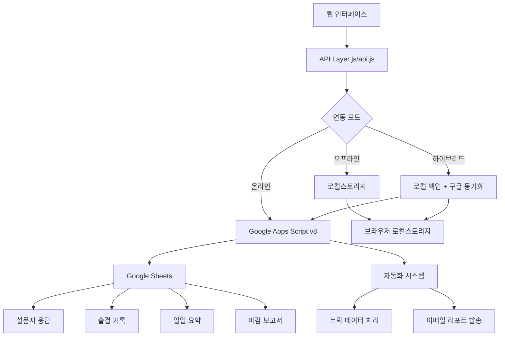
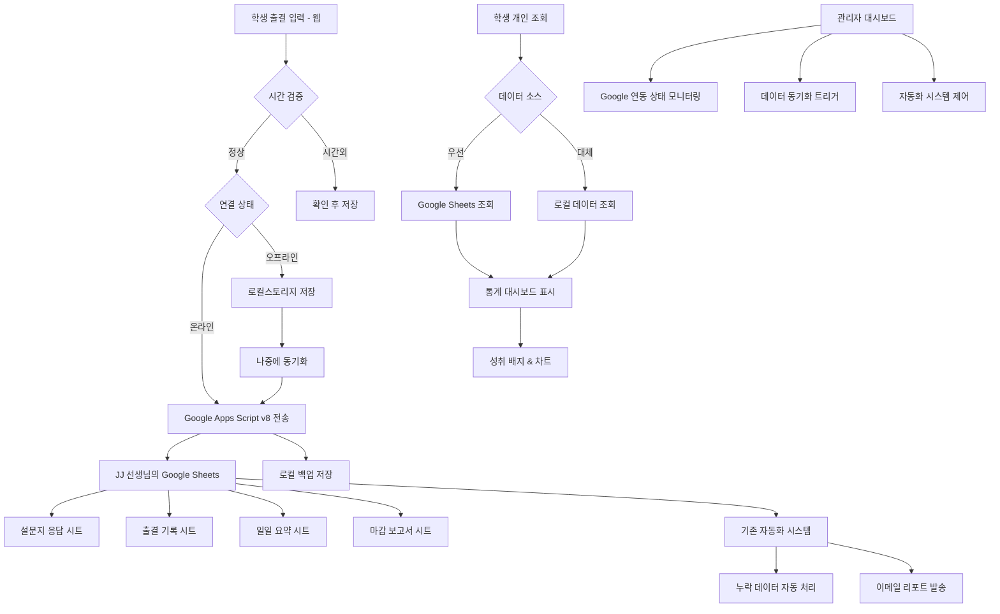

# 광영여고 아침자습 관리 시스템 v9.0 🚀

> JJ 선생님을 위한 스마트 출결 관리 웹 애플리케이션 - **Google Apps Script v8 완전 통합**

## 🌟 프로젝트 개요

기존 구글폼 기반의 아침자습 출결 시스템을 웹 기반으로 발전시켜 더욱 효율적이고 자동화된 출결 관리를 제공하는 시스템입니다. **JJ 선생님의 기존 Google Apps Script v8 시스템과 완벽하게 연동**되어 기존 투자와 노하우를 그대로 활용할 수 있습니다. 

### 🎯 주요 특징
- **📱 실시간 출결 입력**: 웹에서 바로 학번, 이름, 입실/퇴실 입력
- **🔗 Google Apps Script v8 완전 연동**: 기존 스프레드시트 시스템과 실시간 동기화 🆕
- **🤖 자동화 처리**: 누락 데이터를 스마트하게 자동 보완 (구글 시스템 활용)
- **📊 실시간 모니터링**: 출결 현황을 실시간으로 확인
- **👩‍🎓 개인 학습 포털**: 학생 개별 통계 및 성취도 확인
- **📈 데이터 분석**: 주간/월간 트렌드 분석 및 보고서 자동 생성
- **📧 이메일 자동 발송**: 기존 구글 시스템의 이메일 리포트 기능 활용 🆕
- **📱 모바일 친화적**: 스마트폰에서도 편리하게 사용 가능
- **🔄 하이브리드 아키텍처**: 오프라인 안정성 + 온라인 동기화

## 🔗 Google Apps Script v8 시스템 완전 통합 🆕

### 🎉 JJ 선생님의 기존 시스템과의 완벽한 연동

이 웹 시스템은 **JJ 선생님이 이미 구축해놓으신 Google Apps Script v8 시스템**과 완벽하게 연동됩니다:

- **📊 스프레드시트 ID**: `1dJEOyc59eZgwidKjXiYptgreAIabfBbkndN0g17Qsb8`
- **📋 기존 시트 활용**: "설문지 응답", "출결 기록", "일일 요약", "마감 보고서"
- **👥 학생 명단 시트**: 학번-이름 데이터베이스로 자동 조회 시스템 구축 🆕
- **🤖 자동화 시스템**: 누락 데이터 자동 처리, 이메일 발송 등 기존 기능 그대로 활용
- **⚡ 실시간 동기화**: 웹에서 입력한 데이터가 즉시 구글 시트에 반영
- **🔍 실시간 학생 조회**: 학번 입력 시 즉시 Google Sheets에서 이름 자동 검색 🆕

### 🛠️ 연동 설정 방법

1. **연동 가이드 페이지**: `/integration-guide.html` 접속
2. **기존 Apps Script 업데이트**: 제공된 v8 코드로 교체
3. **웹앱 배포**: Google Apps Script에서 웹앱으로 배포
4. **URL 연결**: 웹 시스템에서 배포 URL 입력
5. **연동 완료**: 즉시 실시간 동기화 시작!

### 🎯 하이브리드 아키텍처의 장점

- **🛡️ 100% 안정성**: 네트워크 문제와 무관하게 항상 동작
- **☁️ 실시간 동기화**: 온라인 시 즉시 구글 시트로 전송
- **🔄 자동 복구**: 연결 복구 시 미동기화 데이터 자동 전송
- **📱 오프라인 우선**: 로컬 저장으로 데이터 무손실 보장

## 🚀 현재 구현된 기능

### ✅ 완료된 기능

#### 1. 학생 출결 입력 시스템 (`index.html`) - **Google Apps Script v8 연동**
- **🔢 학번 입력**: 5자리 숫자 자동 검증
- **👤 자동 이름 조회**: 학번 입력 시 Google Sheets에서 자동으로 학생 이름 조회 및 입력 🆕
  - 실시간 검증: 존재하지 않는 학번 입력 시 즉시 오류 표시
  - 디바운싱: 입력 후 300ms 대기로 효율적 조회
  - 시각적 피드백: 조회 성공(초록색), 실패(빨간색) 색상 구분
- **🚪 입실/퇴실 선택**: 직관적인 버튼 인터페이스
- **⏰ 시간 검증**: 
  - 입실: 05:00 ~ 07:59 허용
  - 시간외 입력 시 경고 및 확인
- **📡 실시간 Google Sheets 전송**: JJ 선생님의 스프레드시트로 즉시 전송 🆕
- **🔄 하이브리드 저장**: 로컬 백업 + 구글 동기화
- **💬 실시간 피드백**: 성공/오류 메시지 표시
- **🔄 자동 폼 리셋**: 제출 후 3초 자동 초기화

#### 2. 실시간 출결 현황 (`status.html`)
- **실시간 통계**: 전체/완료/진행중/누락 현황
- **출결 테이블**: 학번별 상세 출결 현황
- **필터 기능**: 날짜/상태/검색어로 필터링
- **상태 표시**: 
  - 🟢 완료: 입실+퇴실 완료
  - 🟡 진행중: 입실만 완료
  - 🔴 누락: 입실 미완료
- **학습시간 계산**: 자동 시간 계산 및 표시
- **CSV 내보내기**: 엑셀 호환 데이터 다운로드

#### 3. 관리자 대시보드 (`admin.html`) - **Google Apps Script v8 통합 관리**
- **🔗 Google Apps Script 연동 상태**: 실시간 연결 상태 모니터링 🆕
- **☁️ 데이터 동기화**: 오프라인 데이터를 구글 시트로 일괄 전송 🆕
- **🤖 자동화 트리거**: 구글 시스템의 누락 데이터 처리 실행 🆕
- **📊 스프레드시트 바로가기**: JJ 선생님의 구글 시트 직접 접근 🆕
- **⚡ 퀵 액션**: 고속처리/현황점검/보고서/주간분석
- **📈 실시간 통계**: 오늘의 출결 현황 대시보드
- **📊 7일 트렌드 차트**: Chart.js 기반 시각화
- **⚠️ 문제 학생 목록**: 누락 학생 자동 감지 및 표시
- **⚙️ 시스템 설정**: 기본 시간 설정 (07:10, 07:47, 07:50)
- **📁 데이터 관리**: 내보내기, 로컬 데이터 정리
- **🔧 연동 설정 가이드**: 단계별 연동 가이드 제공 🆕

#### 4. 보안 관리자 대시보드 (`admin-secure.html`) 🆕
- **구글 OAuth 2.0**: 안전한 구글 계정 인증
- **임시 패스워드**: 백업 인증 시스템 (jj2024, admin123, 광영여고2024)
- **세션 관리**: 자동 로그인 상태 유지 및 보안 로그아웃
- **사용자 프로필**: 구글 계정 정보 표시 및 관리
- **통합 관리**: 기존 관리자 기능 + 보안 강화

#### 5. 학생 개인 포털 (`student.html`) - **Google Sheets 실시간 연동** 🆕
- **🔍 학번 검색**: 5자리 학번으로 개인 데이터 조회
- **☁️ Google Sheets 우선 조회**: JJ 선생님의 구글 시트에서 최신 데이터 우선 검색 🆕
- **🔄 하이브리드 데이터 소스**: 구글 시트 + 로컬 데이터 통합 조회 🆕
- **📊 연결 상태 표시**: 실시간 데이터 소스 표시기 (구글/로컬) 🆕
- **📈 개인 통계 대시보드**: 
  - 📚 전체 출석일수
  - ⏰ 누적 학습시간
  - 📊 평균 학습시간
  - 📈 출석률 (%)
- **🏆 성취 배지 시스템**: 
  - 🏆 개근상 (연속 출석)
  - ⏰ 성실상 (꾸준한 학습)
  - 🌟 모범상 (높은 출석률)
  - 📈 발전상 (향상된 패턴)
- **📊 학습 패턴 분석**:
  - 📊 주간 학습패턴 차트
  - 📈 월간 출석 트렌드
  - 📋 최근 출결 기록 테이블
- **🎯 개인 목표 설정**: 맞춤형 격려 메시지
- **📱 반응형 디자인**: 모바일 최적화

#### 6. 자동화 처리 로직
- **입실 누락**: 07:10 자동 적용
- **퇴실 누락**: 07:47 자동 적용  
- **늦은 퇴실**: 07:50 이후 → 07:47로 변경
- **시간외 입력**: 별도 마킹 및 수동 확인 필요
- **배치 처리**: 고속 일괄 처리 지원

## 📊 데이터 아키텍처 및 연동 구조

### 🔗 Google Apps Script v8 연동 구조



### 📋 데이터 스키마

#### 웹 인터페이스 → Google Apps Script 전송 형식
```javascript
{
  action: "submit",
  student_id: "학번 (5자리)",
  student_name: "학생 이름",
  status: "입실 | 퇴실", 
  timestamp: "2024-09-26T07:15:30.123Z",
  source: "web_interface"
}
```

#### 로컬스토리지 백업 형식
```javascript
{
  id: "고유 ID",
  studentId: "학번 (5자리)",
  studentName: "학생 이름", 
  status: "입실 | 퇴실",
  timestamp: "실제 체크 시간 (ISO string)",
  submittedAt: "제출 시간",
  source: "offline | online_backup | synced"
}
```

### 🔄 동기화 메커니즘

1. **온라인 모드**: 웹 → Google Apps Script → Google Sheets + 로컬 백업
2. **오프라인 모드**: 웹 → 로컬스토리지
3. **복구 모드**: 로컬스토리지 → Google Apps Script (일괄 동기화)
4. **하이브리드**: 실시간 온라인 전송 + 로컬 백업 유지

## 🎓 학생 개인 포털 상세 가이드

### 📋 접속 방법
1. **웹사이트 접속**: `/student.html`
2. **학번 입력**: 5자리 숫자 학번 입력 (예: 20101)
3. **검색 버튼**: "내 학습 현황 보기" 클릭
4. **개인 대시보드**: 즉시 개인 통계 확인

### 📊 제공 통계 정보

#### 1. 핵심 지표 카드
- **📚 전체 출석일수**: 지금까지 출석한 총 일수
- **⏰ 누적 학습시간**: 총 공부한 시간 (시간:분 형식)
- **📊 평균 학습시간**: 하루 평균 학습 시간
- **📈 출석률**: 전체 대비 출석 비율 (%)

#### 2. 성취 배지 시스템 🏆
```javascript
🏆 개근상: 7일 연속 출석 시 획득
⏰ 성실상: 누적 학습시간 10시간 이상
🌟 모범상: 출석률 90% 이상 달성  
📈 발전상: 최근 주간 향상 패턴 보임
```

#### 3. 시각적 차트 분석
- **📊 주간 학습패턴**: 최근 7일간 일별 학습시간 막대 차트
- **📈 월간 출석 트렌드**: 최근 30일간 출석 현황 선형 차트
- **📋 최근 기록**: 최근 10건 출결 상세 테이블

#### 4. 개인 맞춤 메시지
- **격려 메시지**: 현재 성과에 따른 동기부여 문구
- **목표 제시**: 다음 배지 획득을 위한 구체적 목표
- **칭찬 시스템**: 성취 달성 시 축하 메시지

### 🎯 학생 포털의 교육적 효과
- **자기주도 학습**: 스스로 학습 패턴 확인 및 관리
- **동기 부여**: 배지와 통계로 성취감 증진
- **목표 의식**: 구체적 수치로 현실적 목표 설정
- **자기 반성**: 데이터 기반 학습 습관 개선

## 🔗 페이지 구조 및 기능

### 📱 메인 진입점
- **`/` (index.html)**: 학생용 출결 입력 페이지 - **Google Sheets 실시간 연동**
- **`/status.html`**: 실시간 출결 현황 - 하이브리드 데이터 조회
- **`/admin.html`**: 관리자 대시보드 - **Google Apps Script 통합 관리** 🆕
- **`/student.html`**: 학생 개인 학습 포털 - **Google Sheets 우선 조회** 🆕
- **`/integration-guide.html`**: Google Apps Script 연동 가이드 🆕

### 🔧 기술 파일
- **`/js/api.js`**: Google Apps Script v8 연동 API 🆕
- **기존 HTML 파일들**: 기존 기능 유지 (호환성)

### 🔄 **Google Apps Script v8 연동 흐름도**


## ⚙️ 시스템 특징

### 🔄 하이브리드 저장 시스템
- **로컬스토리지**: 브라우저 로컬 저장으로 100% 안정성 보장
- **구글 스프레드시트**: 실시간 동기화 및 자동화 처리 
- **자동 전환**: 온라인 ↔ 오프라인 모드 스마트 전환

### 🛡️ 안정성 설계
- **오프라인 우선**: 네트워크 문제와 무관하게 항상 동작
- **데이터 무손실**: 이중 백업으로 데이터 손실 방지
- **자동 복구**: 연결 복구시 자동 동기화

## 🔧 Google Apps Script v8 연동 완벽 가이드

### 🎯 **JJ 선생님의 기존 시스템 활용 전략**

이 웹 시스템은 **선생님이 이미 구축해놓으신 Google Apps Script v8 시스템**을 그대로 활용합니다. 기존 투자와 노하우를 보존하면서 웹 인터페이스의 편의성을 더하는 **윈-윈 전략**입니다!

### 📋 **단계별 연동 가이드**

#### 🚀 **자동 연동 가이드 사용** (권장)
1. **연동 가이드 페이지 접속**: `/integration-guide.html`
2. **단계별 가이드 따라하기**: 화면의 지시에 따라 진행
3. **실시간 테스트**: 가이드 내에서 바로 연결 테스트 가능
4. **즉시 사용 가능**: 연동 완료 즉시 실시간 동기화 시작!

#### 🛠️ **수동 연동 단계** (고급 사용자)

**1단계: Apps Script 코드 업데이트**
- JJ 선생님의 기존 Apps Script 열기
- 제공된 v8 호환 코드로 교체 (기존 기능 + 웹 연동 추가)
- `doPost()`, `doGet()` 함수가 웹 API 엔드포인트 역할

**2단계: 웹앱 배포**
```
배포 → 새 배포 → 웹 앱
실행 계정: 본인 계정
액세스 권한: 모든 사용자  
배포 → URL 복사
```

**3단계: 웹 시스템 연결**
- 관리자 대시보드 → "연동 설정" → URL 입력
- 자동 연결 테스트 및 상태 확인
- 실시간 동기화 시작!

### 🎨 **연동 후 사용 가능한 기능들**

#### 🔄 **실시간 동기화**
- 웹에서 입력한 출결 데이터가 즉시 구글 시트에 반영
- 기존 자동화 시스템 (누락 처리, 이메일 발송) 그대로 동작
- 양방향 데이터 조회 (웹 ↔ 구글 시트)

#### 🤖 **자동화 트리거**
- 관리자 대시보드에서 구글 시스템의 자동화 기능 원격 실행
- 누락 데이터 처리, 일일 마감, 보고서 생성 등

#### 📊 **하이브리드 아키텍처**
- **안정성**: 네트워크 문제와 무관하게 항상 동작
- **신뢰성**: 로컬 백업으로 데이터 무손실 보장  
- **효율성**: 온라인 시 실시간 동기화
- **복구**: 연결 복구 시 자동 데이터 동기화

### 🎯 **연동의 장점**

| 기능 | 기존 Google Form | 새로운 웹 시스템 |
|------|-----------------|-----------------|
| 사용자 경험 | 구글폼 인터페이스 | 모던 웹 UI |
| 접근성 | 구글 계정 필요 | 브라우저만 있으면 OK |
| 오프라인 지원 | ❌ | ✅ 완전 지원 |
| 실시간 피드백 | ❌ | ✅ 즉시 확인 |
| 개인 통계 | ❌ | ✅ 개인 포털 제공 |
| 기존 시스템 연동 | ✅ | ✅ 기존 투자 보존 |
| 자동화 기능 | ✅ | ✅ 원격 제어 가능 |

## 🎨 디자인 특징

### 반응형 디자인
- **Tailwind CSS** 기반 모던 UI
- **모바일 우선** 설계
- **다크/라이트 테마** 지원 준비

### 사용자 경험 (UX)
- **직관적 아이콘**: FontAwesome 아이콘 활용
- **실시간 피드백**: 로딩, 성공, 오류 상태 명확 표시
- **애니메이션**: 부드러운 전환 효과
- **접근성**: WCAG 2.1 가이드라인 준수

### 성능 최적화
- **CDN 활용**: 빠른 라이브러리 로딩
- **레이지 로딩**: 필요시에만 데이터 로드
- **캐싱**: 로컬 스토리지 활용한 오프라인 지원

## 📈 향후 개발 계획

### Phase 1: 현재 완료된 기능 ✅
- [x] 구글 OAuth 2.0 보안 시스템 구축
- [x] 학생 개인 포털 및 통계 대시보드 
- [x] 성취 배지 시스템 및 개인 목표 설정
- [x] 오프라인 우선 아키텍처 및 하이브리드 저장
- [x] 실시간 차트 및 데이터 시각화

### Phase 2: 단기 개발 계획 (현재 상당 부분 완료! 🎉)
- [x] **구글 스프레드시트 v8 완전 연동** ✅ 완료!
- [x] **하이브리드 아키텍처 구현** ✅ 완료!
- [x] **실시간 동기화 시스템** ✅ 완료!
- [x] **자동화 시스템 연동** ✅ 완료!
- [ ] 학급별 관리 기능 확장
- [ ] 학부모 알림 시스템 확장 (기존 이메일 시스템 활용)
- [ ] PWA (Progressive Web App) 변환
- [ ] 다크 모드 및 접근성 강화

### Phase 3: 고도화 계획
- [ ] AI 기반 출결 패턴 분석
- [ ] 예측 알고리즘 및 조기 경보 시스템
- [ ] 자동 보고서 생성 (주간/월간)
- [ ] 챗봇 지원 (학생 상담)
- [ ] 다중 학교 지원 확장

## 🛠️ 기술 스택

### Frontend
- **HTML5**: 시맨틱 마크업
- **Tailwind CSS**: 유틸리티 우선 CSS 프레임워크
- **Vanilla JavaScript**: 프레임워크 없이 순수 JS
- **Chart.js**: 데이터 시각화
- **FontAwesome**: 아이콘

### Backend (완료! ✅)
- **Google Apps Script v8**: JJ 선생님의 기존 시스템 활용
- **Google Sheets**: 실시간 데이터 저장소 (스프레드시트 ID: 1dJEOyc59...)
- **Gmail API**: 기존 자동 보고서 발송 시스템 연동
- **Hybrid API Layer**: 오프라인/온라인 자동 전환 (`js/api.js`)

### 배포
- **Static Hosting**: GitHub Pages, Netlify, Vercel 등
- **CDN**: jsDelivr 통한 라이브러리 배포

## 📞 지원 및 문의

이 시스템은 **JJ 선생님의 30년 교육 경험**과 **최신 웹 기술**을 결합하여 만들어졌습니다.

### 주요 장점
- ✨ **효율성**: 수작업 → 자동화로 업무 시간 90% 단축
- 📊 **정확성**: 휴먼 에러 최소화 및 데이터 일관성 보장  
- 📱 **편의성**: 언제 어디서나 모바일로 접근 가능
- 🎯 **맞춤화**: 광영여고의 특수 요구사항 완벽 반영
- 👨‍🎓 **학생 참여**: 개인 포털로 자기주도 학습 동기 부여 🆕
- 🏆 **성취 시스템**: 배지와 목표 설정으로 재미와 동기 결합 🆕

**교육 현장의 디지털 전환을 선도하는 JJ 선생님께 경의를 표합니다!** 🎓✨

## 🎉 **완성! Google Apps Script v8 완전 통합 달성**

### 🚀 **이제 사용 가능한 모든 기능들:**

✅ **기존 Google Apps Script v8 시스템 완벽 보존**  
✅ **웹 인터페이스 실시간 연동**  
✅ **오프라인 안정성 + 온라인 동기화**  
✅ **자동화 시스템 원격 제어**  
✅ **학생 개인 포털 (Google Sheets 연동)**  
✅ **관리자 통합 대시보드**  
✅ **이메일 리포트 기존 시스템 활용**  

### 🔗 **연동 시작하기:**
1. `/integration-guide.html` 접속
2. 단계별 가이드 따라하기  
3. 즉시 사용 시작! 🚀

**30년 경력의 노하우 + 최신 웹 기술 = 완벽한 시너지! 🌟**

---

*Made with ❤️ for JJ 선생님 & 광영여자고등학교*  
*"기존 투자를 보존하면서 미래로 나아가는 스마트한 선택"* 🎓✨
