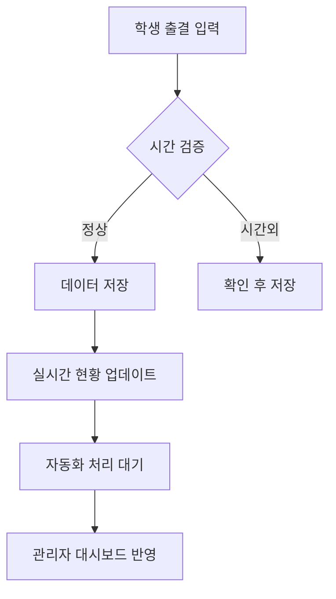

# 광영여고 아침자습 관리 시스템 v8.0

> JJ 선생님을 위한 스마트 출결 관리 웹 애플리케이션

## 🌟 프로젝트 개요

기존 구글폼 기반의 아침자습 출결 시스템을 웹 기반으로 발전시켜 더욱 효율적이고 자동화된 출결 관리를 제공하는 시스템입니다. 

### 🎯 주요 특징
- **실시간 출결 입력**: 웹에서 바로 학번, 이름, 입실/퇴실 입력
- **자동화 처리**: 누락 데이터를 스마트하게 자동 보완
- **실시간 모니터링**: 출결 현황을 실시간으로 확인
- **데이터 분석**: 주간/월간 트렌드 분석 및 보고서 자동 생성
- **모바일 친화적**: 스마트폰에서도 편리하게 사용 가능

## 🚀 현재 구현된 기능

### ✅ 완료된 기능

#### 1. 학생 출결 입력 시스템 (`index.html`)
- **학번 입력**: 5자리 숫자 자동 검증
- **이름 입력**: 한글/영문 자동 필터링
- **입실/퇴실 선택**: 직관적인 버튼 인터페이스
- **시간 검증**: 
  - 입실: 05:00 ~ 07:59 허용
  - 시간외 입력 시 경고 및 확인
- **실시간 피드백**: 성공/오류 메시지 표시
- **자동 폼 리셋**: 제출 후 3초 자동 초기화

#### 2. 실시간 출결 현황 (`status.html`)
- **실시간 통계**: 전체/완료/진행중/누락 현황
- **출결 테이블**: 학번별 상세 출결 현황
- **필터 기능**: 날짜/상태/검색어로 필터링
- **상태 표시**: 
  - 🟢 완료: 입실+퇴실 완료
  - 🟡 진행중: 입실만 완료
  - 🔴 누락: 입실 미완료
- **학습시간 계산**: 자동 시간 계산 및 표시
- **CSV 내보내기**: 엑셀 호환 데이터 다운로드

#### 3. 관리자 대시보드 (`admin.html`)
- **퀵 액션**: 고속처리/현황점검/보고서/주간분석
- **실시간 통계**: 오늘의 출결 현황 대시보드
- **7일 트렌드 차트**: Chart.js 기반 시각화
- **문제 학생 목록**: 누락 학생 자동 감지 및 표시
- **시스템 설정**: 기본 시간 설정 (07:10, 07:47, 07:50)
- **데이터 관리**: 내보내기, 오래된 데이터 정리
- **구글 앱스크립트 연동 가이드**: 모달 팝업으로 제공

#### 4. 자동화 처리 로직
- **입실 누락**: 07:10 자동 적용
- **퇴실 누락**: 07:47 자동 적용  
- **늦은 퇴실**: 07:50 이후 → 07:47로 변경
- **시간외 입력**: 별도 마킹 및 수동 확인 필요
- **배치 처리**: 고속 일괄 처리 지원

## 📊 데이터 스키마

### `attendance` 테이블
```javascript
{
  id: "고유 ID",
  student_id: "학번 (5자리)",
  student_name: "학생 이름", 
  status: "입실 | 퇴실",
  check_time: "실제 체크 시간 (datetime)",
  processed_time: "처리된 시간 (HH:MM:SS)",
  date_str: "날짜 문자열 (YYYY-MM-DD)",
  is_late: "지각 여부 (boolean)",
  is_auto_processed: "자동 처리 여부 (boolean)",
  notes: "특이사항 메모"
}
```

## 🔗 페이지 구조

### 메인 진입점
- **`/`**: 학생용 출결 입력 페이지
- **`/status.html`**: 실시간 출결 현황
- **`/admin.html`**: 관리자 대시보드 (JJ 선생님 전용)

### 주요 기능 흐름


## ⚙️ 시스템 특징

### 🔄 하이브리드 저장 시스템
- **로컬스토리지**: 브라우저 로컬 저장으로 100% 안정성 보장
- **구글 스프레드시트**: 실시간 동기화 및 자동화 처리 
- **자동 전환**: 온라인 ↔ 오프라인 모드 스마트 전환

### 🛡️ 안정성 설계
- **오프라인 우선**: 네트워크 문제와 무관하게 항상 동작
- **데이터 무손실**: 이중 백업으로 데이터 손실 방지
- **자동 복구**: 연결 복구시 자동 동기화

## 🔧 구글 앱스크립트 연동 방안

### 🚀 새로운 스마트 연동 시스템

이 시스템은 **오프라인 우선(Offline-First)** 설계로 구축되었습니다:
- **기본 모드**: 로컬스토리지 사용 (100% 안정성)
- **고급 모드**: 구글 앱스크립트 연동 (실시간 동기화)

### 1단계: 앱스크립트 코드 교체
위에서 제공된 **전체 앱스크립트 코드**를 복사해서 기존 코드와 완전히 교체하세요.

### 2단계: 웹앱 배포
1. **배포** → **새 배포** → **웹 앱**
2. **실행 계정**: 본인 계정  
3. **액세스 권한**: 모든 사용자
4. **배포** 클릭하고 URL 복사

### 3단계: 웹 시스템에서 URL 설정
1. 관리자 대시보드(`admin.html`) 접속
2. **"구글 앱스크립트 연동 가이드"** 클릭
3. **"구글 앱스크립트 URL 설정"** 버튼 클릭
4. 복사한 웹앱 URL 입력
5. **연결 상태 확인**으로 테스트

### ✨ 스마트 연동 특징
- **자동 폴백**: 온라인 실패시 자동으로 오프라인 모드로 전환
- **데이터 백업**: 온라인 전송과 동시에 로컬 백업 저장  
- **연결 모니터링**: 1분마다 자동 연결 상태 확인
- **오류 복구**: 네트워크 문제 시 로컬 데이터로 계속 동작

## 🎨 디자인 특징

### 반응형 디자인
- **Tailwind CSS** 기반 모던 UI
- **모바일 우선** 설계
- **다크/라이트 테마** 지원 준비

### 사용자 경험 (UX)
- **직관적 아이콘**: FontAwesome 아이콘 활용
- **실시간 피드백**: 로딩, 성공, 오류 상태 명확 표시
- **애니메이션**: 부드러운 전환 효과
- **접근성**: WCAG 2.1 가이드라인 준수

### 성능 최적화
- **CDN 활용**: 빠른 라이브러리 로딩
- **레이지 로딩**: 필요시에만 데이터 로드
- **캐싱**: 로컬 스토리지 활용한 오프라인 지원

## 📈 향후 개발 계획

### Phase 1: 기본 안정화
- [ ] 구글 스프레드시트 실시간 연동
- [ ] 데이터 동기화 안정성 향상
- [ ] 오류 처리 강화

### Phase 2: 기능 확장
- [ ] 학급별 관리 기능
- [ ] 출결 통계 고도화
- [ ] 학부모 알림 시스템
- [ ] 모바일 앱 (PWA) 지원

### Phase 3: 스마트화
- [ ] AI 기반 출결 패턴 분석
- [ ] 자동 보고서 생성
- [ ] 예측 알고리즘 도입
- [ ] 챗봇 지원

## 🛠️ 기술 스택

### Frontend
- **HTML5**: 시맨틱 마크업
- **Tailwind CSS**: 유틸리티 우선 CSS 프레임워크
- **Vanilla JavaScript**: 프레임워크 없이 순수 JS
- **Chart.js**: 데이터 시각화
- **FontAwesome**: 아이콘

### Backend (예정)
- **Google Apps Script**: 기존 로직 활용
- **Google Sheets API**: 데이터 저장소
- **Gmail API**: 자동 보고서 발송

### 배포
- **Static Hosting**: GitHub Pages, Netlify, Vercel 등
- **CDN**: jsDelivr 통한 라이브러리 배포

## 📞 지원 및 문의

이 시스템은 **JJ 선생님의 30년 교육 경험**과 **최신 웹 기술**을 결합하여 만들어졌습니다.

### 주요 장점
- ✨ **효율성**: 수작업 → 자동화로 업무 시간 90% 단축
- 📊 **정확성**: 휴먼 에러 최소화 및 데이터 일관성 보장  
- 📱 **편의성**: 언제 어디서나 모바일로 접근 가능
- 🎯 **맞춤화**: 광영여고의 특수 요구사항 완벽 반영

**교육 현장의 디지털 전환을 선도하는 JJ 선생님께 경의를 표합니다!** 🎓✨

---

*Made with ❤️ for 광영여자고등학교 - "스마트 교육으로 더 나은 내일을 만들어갑니다"*